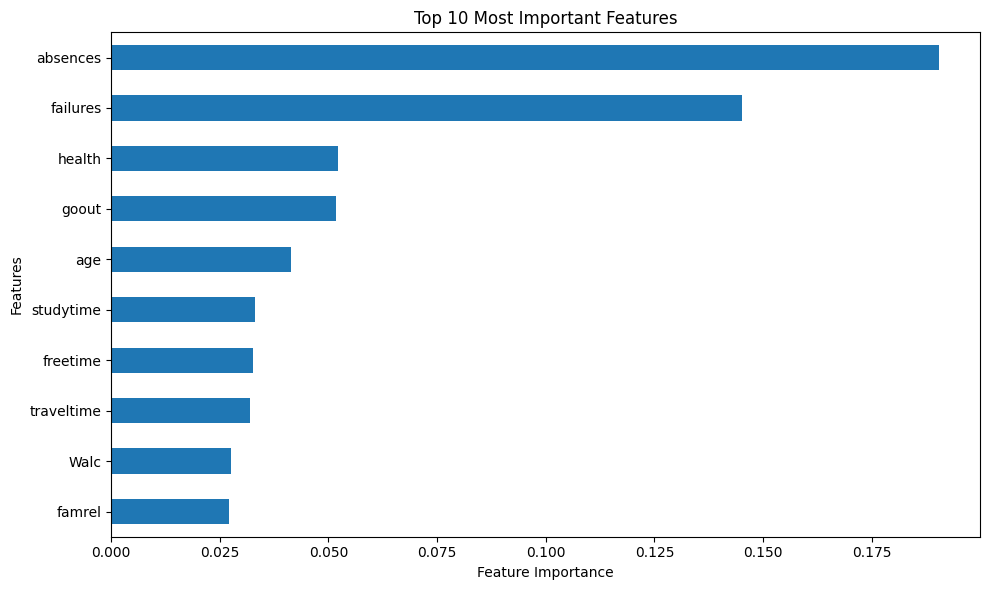

# 📊 Predicting Student Academic Performance Using Machine Learning

## Overview

This project investigates whether demographic, family, and lifestyle factors can predict students' final academic performance using machine learning.

To ensure a fair evaluation, previous grades (G1 and G2) were intentionally excluded from the input features to prevent data leakage. Three regression models were trained and compared using standard evaluation metrics.

---

## Research Question

Can demographic, family, and lifestyle characteristics predict students' final grades without relying on previous academic performance?

---

## Dataset

- **Source:** UCI Student Performance Dataset
- **Students:** 395
- **Target Variable:** Final Grade (G3)
- **Predictor Variables:** Demographic, family, school, and lifestyle features

---

## Machine Learning Models

- Linear Regression
- Random Forest Regressor
- Gradient Boosting Regressor

---

## Evaluation Metrics

- Mean Absolute Error (MAE)
- Root Mean Squared Error (RMSE)
- R² Score
- 5-Fold Cross Validation

---

## Results

| Model | R² Score |
|-------|----------:|
| Linear Regression | 0.141 |
| Gradient Boosting | 0.209 |
| **Random Forest** | **0.270** |

---

## Key Findings

- Student absences were the most influential feature.
- Previous academic failures were strong predictors.
- Lifestyle and demographic variables alone provided moderate predictive power.
- Random Forest achieved the best overall performance.

---

## Feature Importance



---

## Technologies Used

- Python
- Pandas
- NumPy
- Scikit-learn
- Matplotlib
- Google Colab

---

## Repository Structure

```text
student-performance-ml-study/
│
├── Student_Performance_ML_Comparison.ipynb
├── student_data.csv
├── requirements.txt
├── LICENSE
├── README.md
└── images/
    └── feature_importance.png
```

---

## Future Improvements

- Hyperparameter tuning
- Larger educational datasets
- Streamlit web application for interactive predictions
- Comparison with additional regression algorithms

---

## Author

**Yogesh Ambavaram**
